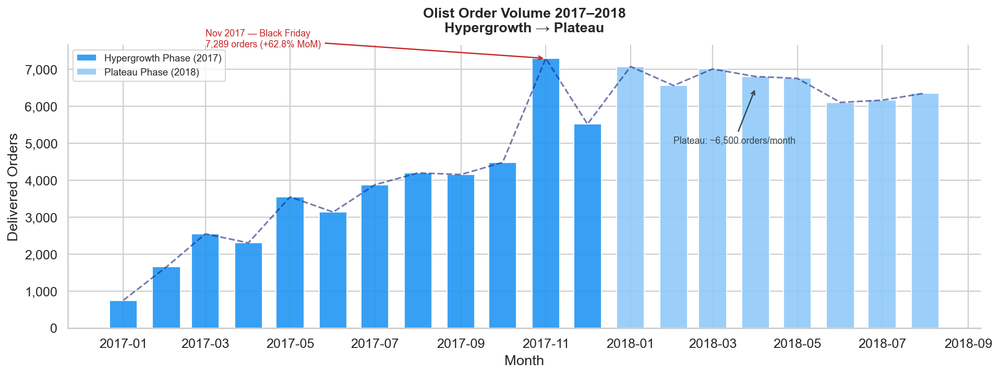
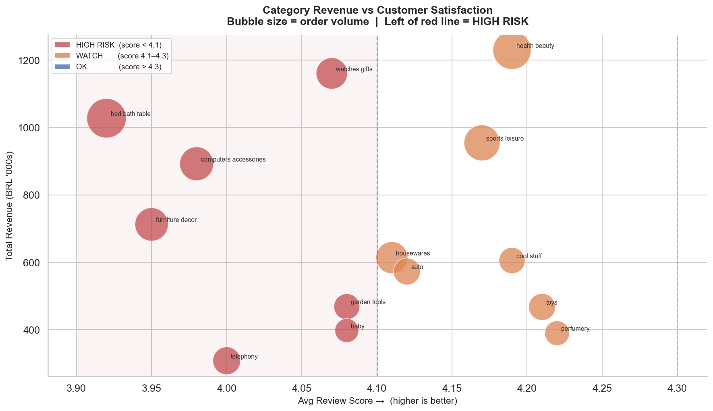
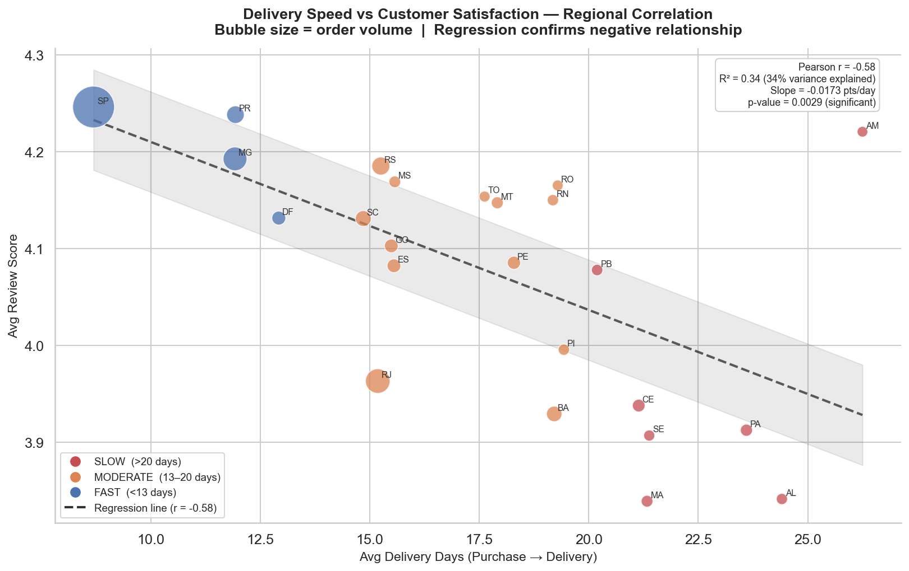
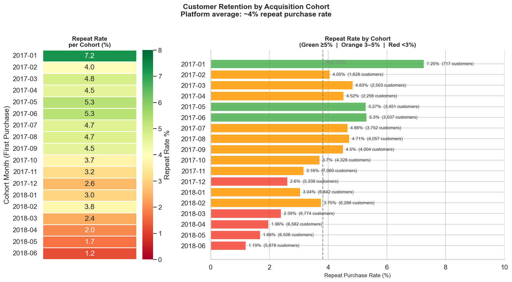

# Olist E-Commerce Business Analysis
### SQL · Python · Power BI · End-to-End BA Project

---

## Business Problem Statement

Olist is a Brazilian e-commerce marketplace connecting small sellers to major retail channels. Despite strong order growth through 2017, the platform faces three operational challenges:

- **Declining customer satisfaction** — average review score of 4.09/5.0 with high-revenue categories scoring below 4.1
- **Poor customer retention** — 96.2% of customers never place a second order
- **Uneven delivery performance** — northeastern states average 21+ days delivery vs 8.7 days in São Paulo

This project analyses 99,441 orders across 8 relational tables to identify the root causes of these problems and deliver actionable recommendations to the operations head.

---

## Dataset Overview

**Source:** [Olist Brazilian E-Commerce Public Dataset — Kaggle](https://www.kaggle.com/datasets/olistbr/brazilian-ecommerce)

| Table | Rows | Description |
|---|---|---|
| olist_orders | 99,441 | Core order lifecycle with timestamps |
| olist_customers | 99,441 | Customer location and unique identifiers |
| olist_order_items | 112,650 | Individual items, prices, seller per order |
| olist_order_payments | 103,886 | Payment method, installments, value |
| olist_order_reviews | 99,224 | Review scores and comment text |
| olist_products | 32,951 | Product category, dimensions, weight |
| olist_sellers | 3,095 | Seller location by state |
| product_category_name_translation | 71 | Portuguese → English category names |

**Period covered:** September 2016 – August 2018
**Geography:** 27 Brazilian states

---

## Tools Used

| Tool | Purpose |
|---|---|
| Python (pandas) | Data cleaning, EDA, visualisation |
| MySQL + DBeaver | SQL analysis — 6 business questions |
| Power BI Desktop | 3-page interactive dashboard |
| Jupyter Notebook (VS Code) | Development environment |

---

## Project Structure

```
olist_project/
├── data/
│   ├── raw/                  # Original Kaggle CSVs (8 files)
│   └── clean/                # Cleaned CSVs after Python processing
├── notebooks/
│   ├── 01_cleaning.ipynb     # Data cleaning + MySQL load
│   └── 02_eda.ipynb          # EDA + 4 analytical charts
├── sql/
│   ├── q1_monthly_trend.sql
│   ├── q2_category_risk.sql
│   ├── q3_delivery_analysis.sql
│   ├── q4_pareto_sellers.sql
│   ├── q5_cohort_retention.sql
│   └── q6_payment_analysis.sql
├── charts/
│   ├── chart1_growth.png
│   ├── chart2_delivery_vs_review.png
│   ├── chart3_category_bubble.png
│   └── chart4_retention_heatmap.png
├── dashboard/
│   └── olist_dashboard.pbix
└── README.md
```

---

## Key Business Questions Answered

| # | Business Question | Method |
|---|---|---|
| Q1 | What is the monthly order trend and MoM growth rate? | SQL + Python |
| Q2 | Which categories have highest revenue but lowest review scores? | SQL + Python |
| Q3 | What is average delivery delay by region and how does it correlate with review score? | SQL + Python |
| Q4 | Which top 20% of sellers drive 80% of revenue? | SQL |
| Q5 | What is repeat purchase rate by customer cohort? | SQL + Python |
| Q6 | Which payment methods correlate with higher order values? | SQL |

---

## Top 5 Findings

### Finding 1 — Hypergrowth ended; business has plateaued

Olist grew 10x between January and November 2017 (750 → 7,289 monthly orders).
From January 2018 onwards the business stabilised at approximately 6,500 orders per month.
The November 2017 spike (+62.8% MoM) was driven by Black Friday seasonal demand.
Growth was driven entirely by new customer acquisition — retention data explains why this is unsustainable.



---

### Finding 2 — Four high-revenue categories are at satisfaction risk

Watches & gifts (1.16M BRL), bed & bath (1.03M BRL), computers & accessories (892K BRL),
and furniture & decor (712K BRL) all score below 4.1 — flagged HIGH RISK.
Combined they represent approximately 3.8M BRL in revenue at risk.
No category above 300K BRL in revenue scores above 4.3.



---

### Finding 3 — Delivery speed is the primary driver of customer satisfaction

FAST regions (under 13 days) average a review score of 4.23.
SLOW regions (over 20 days) average 3.89 — an observed gap of 0.34 points across 27 states.
**Pearson correlation: r = -0.58, p = 0.003** — statistically significant moderate negative relationship.
Delivery speed alone explains **33.8% of the variance** in regional review scores (R² = 0.34).
Every additional day of delivery time reduces average review score by **0.0173 points**.
Regression-predicted gap between SP (8.7 days) and RR (29.3 days): 0.36 points — matches observed 0.34.
AL and MA are highest priority: 21+ days average delivery, sub-3.85 scores, 19%+ late order rates.
SP is the benchmark state: 8.7 days average delivery, 4.25 score, 40% of all platform volume.



---

### Finding 4 — 17.5% of sellers drive 80% of revenue

543 sellers out of 3,095 total generate 80% of platform revenue — a textbook Pareto distribution.
The top seller alone generated 229K BRL.
SP-based sellers dominate the top 20 by revenue, correlating directly with their delivery speed advantage.
The remaining 2,552 sellers share just 20% of revenue — a long tail with minimal impact.

---

### Finding 5 — Customer retention is collapsing across every cohort

Platform average repeat purchase rate: **3.8%** — 96.2% of customers never return.
Peak retention was May–June 2017 at 5.3% during hypergrowth phase.
By mid-2018, new cohorts were returning at under 2%.
The declining trend as the platform scaled suggests rapid acquisition brought in less loyal,
more price-sensitive buyers with no structural incentive to return.



---

## Recommendations

### R1 — Fix delivery in the 5 worst-performing states
**Action:** Partner with regional logistics providers for northeastern states.
Prioritise AL (23.4% late orders, 3.84 score) and MA (19.1% late orders, 3.84 score).
Target: under 18 days average delivery in these states within 6 months.

**Expected impact:** A 0.2-point review score improvement in these states moves them
from below-average to platform average — reducing customer service load and improving NPS.

**Effort:** Medium — logistics vendor negotiation and SLA agreements. No product change required.

---

### R2 — Introduce seller tiering to protect the Pareto core
**Action:** Create a Key Seller Programme for the top 543 sellers generating 80% of revenue.
Assign dedicated account managers, provide performance dashboards,
and offer incentives tied to review score improvement.

**Expected impact:** Reducing top seller churn by 5% protects an estimated 750K–1M BRL
in annual revenue. Improving scores in HIGH RISK categories directly addresses Finding 2.

**Effort:** Low-Medium — commercial and account management initiative.
Requires CRM setup and internal resource allocation.

---

### R3 — Launch a post-purchase retention programme
**Action:** Implement personalised re-engagement for customers 30–45 days after first purchase.
Prioritise customers from FAST delivery regions who left positive reviews.
For HIGH RISK category buyers, add a proactive satisfaction check-in first.

**Expected impact:** Even a 1 percentage point improvement in repeat rate
(3.8% → 4.8%) across 90,000+ unique customers represents ~900 additional
repeat orders per cohort month at 154 BRL average order value.

**Effort:** Medium — requires CRM or email automation setup.

---

## Data Limitations

- **2018 cohort retention** (May onwards) is understated — dataset cuts off before the repeat purchase window closes for these customers
- **2016 data excluded** from trend analysis — Olist was in launch phase with under 300 orders/month
- **Review scores reflect perception** — a 3.9 score could reflect delivery, product quality, or expectation mismatch; delivery assumed primary driver based on observed correlation
- **Seller identity** — seller_id is hashed; same business under multiple IDs would understate true concentration risk
- **August 2018 orders** — partial month, lower volume than reality


*Dataset: Olist Brazilian E-Commerce Public Dataset (Kaggle) | Period: 2016–2018 | 99,441 orders*
